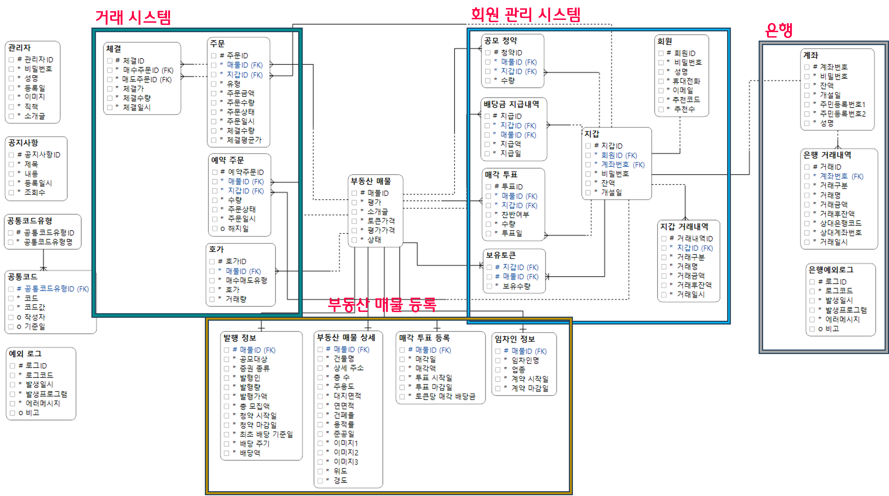
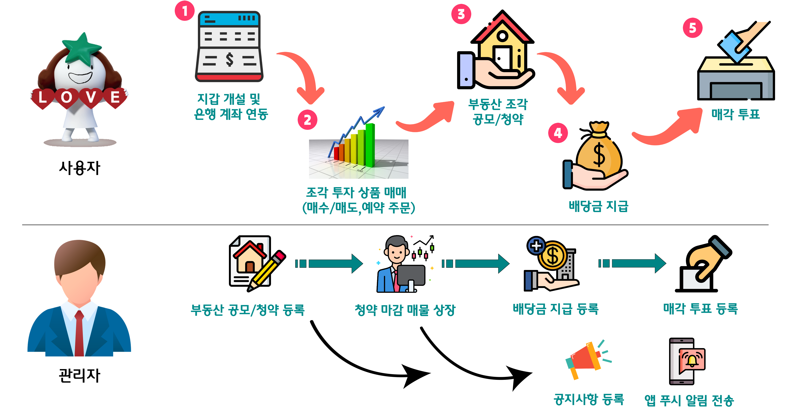

# [하나1PIECE] - 부동산 조각투자 중계 플랫폼
#### 하나금융티아이 채용연계형 교육 최종프로젝트
[프로젝트 홈페이지](/)
 <br/>

# 1. 프로젝트 소개
### 1-1. 프로젝트 제안 배경
 <br/>

 <br/>
- 여러 IT 기업과 금융사가 협약을 맺어 토큰 증권 시장 선점을 위해 발 빠르게 대응하고 있다.
- 이러한 실정에, 토큰 증권의 일환인 부동산 조각 투자 중계 플랫폼 <b><i style="color: #008485;">"하나1PIECE"</i></b> 를 개발함.<br/>

### 1-2. 프로젝트 기대효과
 <br/>

### 1-3. 개발환경
 <br/>

### 1-4. 수행기간
개발기간: 2022.09.01 - 2022.10.20
 <br/>

# 2. 프로젝트 구성
### 2-1. 프로젝트 개요
<br/><br/>

<b>부동산 조각투자 거래 서비스</b>
1. 부동산 공모 청약 신청
2. 부동산 조각(토큰) 매매
3. 수익 증권 배당금 지급
4. 매각 투표 참여
5. 매각 배당금 지급
6. 티끌모아 건물주 (예약 주문)
7. 부동산 조각 시세 평가<br/>

<br/>

 <br/><br/>


### 2-2. ERD
 <br/>

### 2-3. 시스템 아키텍처
 <br/>
- 전체 시스템은, 하나1PIECE, 하나은행, 부동산 토큰가격 평가 API로 3가지 시스템으로 구성
- 모든 시스템은 Microsoft azure 클라우드 가상머신에 배포
- 하나1PIECE와 하나은행 시스템은 Spring boot 기반의 MVC 패턴을 이용하여 개발
- 부동산 토큰 가격 평가 API는 Python Flask 프레임워크를 사용하여 개발

```
사용자는 https://hana1piece.store 도메인 접속시,
하나1PIECE 시스템으로 리다이렉트되어 서비스를 이용할 수 있습니다.
```

#### 2-3-1 하나은행 OPEN API 문서
https://gifted-lungfish-f7d.notion.site/OPEN-API-a134a44e62b64eb697ee7a16a49cd99f?pvs=4


#### 2-3-2 부동산 토큰 가격 평가 API 문서
https://gifted-lungfish-f7d.notion.site/API-d9c9e2da0a964bd8a2f5943b35cf7376?pvs=4


### 2-4. 서비스 아키텍처
 <br/>

### 2-5. 주요 응용기술
#### (1) 주문/체결 매칭 알고리즘 개발
 <br/>

#### (2) 배당금 지급 쿼리 개선
 <br/>

#### 그 외 활용 기술
 <br/>


# 3. 프로젝트 결과
### 3-1. 하나1PIECE 투자 프로세스
 <br/>


### 3-2. 발표 ppt
[발표자료](/산출물/최종발표PPT/하나1PIECE(조각투자중계플랫폼)_최종발표_박경덕.pdf) <br/>

### 3-3. 시연 동영상
<a href="https://youtu.be/HvK63AAM3xg"></a><br/>
# 4. 본인 소개

| 구분           | 내용                                                                                          | 비고                                       |
| -------------- | --------------------------------------------------------------------------------------------- | ------------------------------------------ |
| 이름           | 박경덕                       |        |
| 연락처          |이메일                       |baum12345@naver.com                          |
| Skill set     | Language                  | Java, Python, C, PL/SQL, Javascript                                             |
|               | Framework                     | Spring, Mybatis                                             |
|               | Database                  | Oracle                                             |
|               | Etc                       | Git, Oracle Cloud, AWS, Azure, Docker                                             |
| 자격증          | 정보처리기사                                                  | 2022.06.17 |
|               | 정보처리기능사                                                 | 2018.11.15  |
|               | SQLD (SQL개발자)                                             | 2022.09.30  |
|               | 컴퓨터활용능력 2급                                              | 2018.08.17  |
| 수상           | 한국폴리텍대학 벤처창업아이템 경진대회 입선 (동상확보)                                 | 중소벤처기업부(한국폴리텍대학)(2023.11.01) |
| 교육        | 하나금융티아이 채용연계형 교육 1200시간 (한국폴리텍대학교 광명융합기술교육원 - 데이터분석과) | 2023.03.02 ~ 2023.10.20 (1200시간)         |